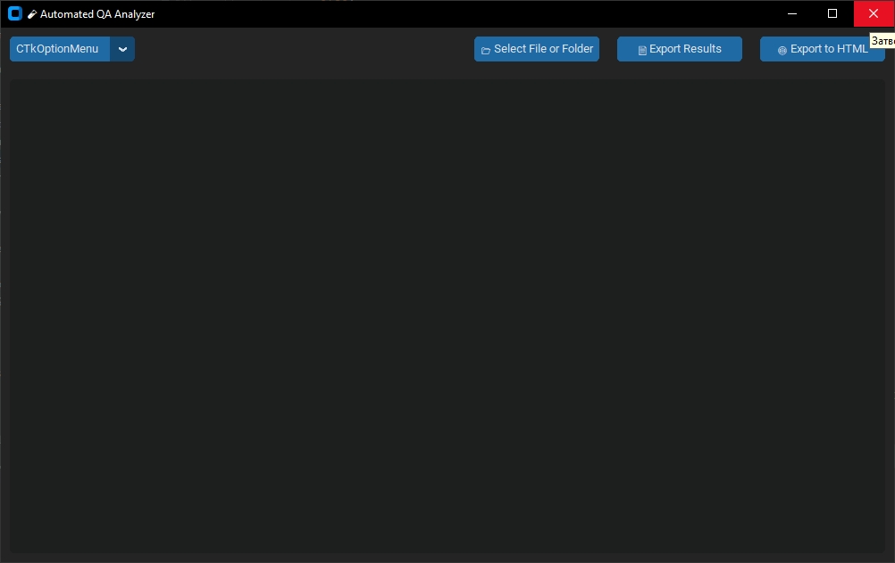

## 🧪 Automated QA Analyzer

> A modern desktop application for fast file content validation and automated quality checks – powered by `Hexagon Lab`.


---

### 🖼️ Screenshot



---

### ⚙️ Features

* ✅ **Validate** file structure and content
* 📂 Support for both single files and full folders
* 💡 Detects issues in various formats (JSON, YAML, XML, etc.)
* 🕘 Remembers the last 5 analyzed paths
* 📄 Export results to `.txt`, `.csv`, or `.html`
* 🌙 Dark mode UI with custom themes

---

### 🧩 Supported File Formats

| Format          | Validator  | Format                                      | Validator      |
| --------------- | ---------- | ------------------------------------------- | -------------- |
| `.json`         | ✅ JSON     | `.ini`                                      | ✅ INI          |
| `.xml`          | ✅ XML      | `.sql`                                      | ✅ SQL          |
| `.yaml`, `.yml` | ✅ YAML     | `.sh`                                       | ✅ Shell script |
| `.md`           | ✅ Markdown | `.log`                                      | ✅ Logs         |
| `.html`         | ✅ HTML     | `.css`                                      | ✅ CSS          |
| `.csv`, `.tsv`  | ✅ CSV      | `.js`                                       | ✅ JavaScript   |
| `.py`           | ✅ Python   | binary files (`.exe`, `.zip`, `.bin`, etc.) | ✅ Binary check |

---

### 📦 Installation

```bash
git clone https://github.com/KallPetrov/Qa-analyzer.git
cd QA_analyzer
pip install -r requirements.txt
```

---

### 🚀 Usage

Run the app with:

```bash
python main.py
```

Then:

1. Click **📂 Select File or Folder**
2. View results in real-time
3. Export findings with **📄 Export** or **🌐 Export to HTML**

---

### 📁 Project Structure

```text
qa-analyzer/
│
├── main.py             # Main GUI application
├── modules.py          # Validation logic for each file type
├── history.json        # Recent file/folder history (auto-generated)
├── requirements.txt    # Dependencies
└── README.md           # You're reading it!
```

---

### ✅ Requirements

* Python 3.8+
* `customtkinter`
* `pyyaml`

Install them via:

```bash
pip install -r requirements.txt
```

---

### 🧠 Credits

Developed with ❤️ by **Hexagon Lab**
Interface powered by [`CustomTkinter`](https://github.com/TomSchimansky/CustomTkinter)

---

### 🪪 License

This project is licensed under the MIT License.

---
